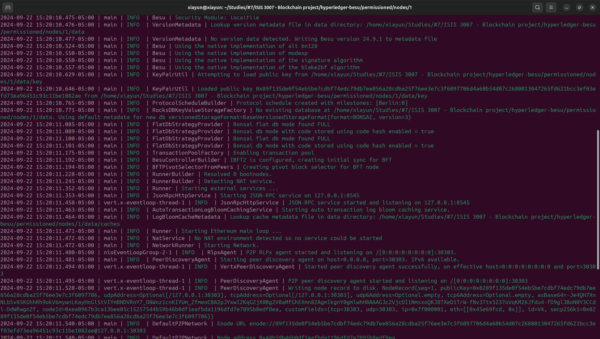

<i>Author: Ronald Pardo</i>
<i>Date: Sep 22th 2024</i>

### Steps to create permissioned blockchain

Steps obtained from this [link](https://besu.hyperledger.org/private-networks/tutorials/permissioning).

#### 1. Create node folders and a data folder inside of them, these are miner-nodes like.

#### 2. Generate genesis file from json config file (ibftConfigFile.json).

#### 3. Run command to generate genesis block and node.

`besu operator generate-blockchain-config --config-file=ibftConfigFile.json --to=networkFiles --private-key-file-name=key`

#### 4. Besu creates the following in the networkFiles directory:

- genesis.json - The genesis file including the extraData property specifying the four nodes are validators.

- A directory for each node named using the node address and containing the public and private key for each node.

#### 5. Copy the genesis file to the Permissioned-Network directory

#### 6. Copy the node private keys to the node directories

Permissioned-Network/
├── genesis.json
├── Node-1
│   ├── data
│   │    ├── key
│   │    ├── key.pub
├── Node-2
│   ├── data
│   │    ├── key
│   │    ├── key.pub
├── Node-3
│   ├── data
│   │    ├── key
│   │    ├── key.pub
├── Node-4
│   ├── data
│   │    ├── key
│   │    ├── key.pub

#### 7. Create the permissions configuration file

The permissions configuration file defines the nodes and accounts allowlists.

Copy the following permissions configuration to a file called permissions_config.toml and save a copy in the Node-1/data, Node-2/data, Node-3/data, and Node-4/data directories:

<i>
permissions_config.toml

`accounts-allowlist=["0xfe3b557e8fb62b89f4916b721be55ceb828dbd73", "0x627306090abaB3A6e1400e9345bC60c78a8BEf57"]`

nodes-allowlist=[]
</i>

The permissions configuration file includes the first two accounts from the genesis file.

Use the perm_addNodesToAllowlist JSON-RPC API method to add permissioned nodes after starting the nodes.

#### 8. Start Node-1

Use the following command (MACos or Linux):

`besu --data-path=data --genesis-file=../../genesis.json --permissions-nodes-config-file-enabled --permissions-accounts-config-file-enabled --rpc-http-enabled --rpc-http-api=ADMIN,ETH,NET,PERM,IBFT --host-allowlist="*" --rpc-http-cors-origins="*"`

- Make sure to correct the genesis.json file to the right relative path

- Make sure to cd into the node folder, in this case `cd nodes/1`

The command line allows you to enable:

- Nodes and accounts permissions using `--permissions-nodes-config-file-enabled` and `--permissions-accounts-config-file-enabled`.
- The JSON-RPC API using `--rpc-http-enabled`.
- The ADMIN, ETH, NET, PERM, and IBFT APIs using `--rpc-http-api`.
- All-host access to the HTTP JSON-RPC API using `--host-allowlist`.
- All-domain access to the node through the HTTP JSON-RPC API using `--rpc-http-cors-origins`.

When the node starts, the enode URL displays. You need the enode URL to specify Node-1 as a peer and update the permissions configuration file in the following steps.

Enode URL: `enode://89f135de0f54eb5be7cdbf74edc79db7ee856a28cdba25f76ee3e7c3f6097706d4a60b54d07c2680013047265fd621bcc3ef03efd73ea96451c93c11be1082ae@127.0.0.1:30303`

#### 9. Start Node-2

Start another terminal, change to the Node-2 directory, and start Node-2:

`besu --data-path=data --genesis-file=../../genesis.json --permissions-nodes-config-file-enabled --permissions-accounts-config-file-enabled --rpc-http-enabled --rpc-http-api=ADMIN,ETH,NET,PERM,IBFT --host-allowlist="*" --rpc-http-cors-origins="*" --p2p-port=30304 --rpc-http-port=8546`

The command line specifies:

- A different port to Node-1 for P2P discovery using --p2p-port.
- A different port to Node-1 for HTTP JSON-RPC using --rpc-http-port.
- A data directory for Node-2 using --data-path.
- Other options as for Node-1.

When the node starts, the enode URL displays. You need the enode URL to update the permissions configuration file in the following steps.

Enode URL: `enode://89f135de0f54eb5be7cdbf74edc79db7ee856a28cdba25f76ee3e7c3f6097706d4a60b54d07c2680013047265fd621bcc3ef03efd73ea96451c93c11be1082ae@127.0.0.1:30304`

#### 10. Start Node-3

Start another terminal, change to the Node-3 directory, and start Node-3:

`besu --data-path=data --genesis-file=../../genesis.json --permissions-nodes-config-file-enabled --permissions-accounts-config-file-enabled --rpc-http-enabled --rpc-http-api=ADMIN,ETH,NET,PERM,IBFT --host-allowlist="*" --rpc-http-cors-origins="*" --p2p-port=30305 --rpc-http-port=8547`

Enode URL: `enode://c77474a77232e597729e3ca72006dc23dd44925f8822712e4aba159252cd0fb5213aaf960e48c39b859f435c009e163cc02e5b1f6530711d150c731bf63def40@127.0.0.1:30305`

#### 11. Start Node-4

Start another terminal, change to the Node-4 directory, and start Node-4:

`besu --data-path=data --genesis-file=../../genesis.json --permissions-nodes-config-file-enabled --permissions-accounts-config-file-enabled --rpc-http-enabled --rpc-http-api=ADMIN,ETH,NET,PERM,IBFT --host-allowlist="*" --rpc-http-cors-origins="*" --p2p-port=30306 --rpc-http-port=8548`

Enode URL: `enode://619492f2ab8637b947034da398dc6728fe655b4e0d71588ae6f6906b24cfe29013c280aeaca237ac190e24c28b496931f21dfa5015a0aa5dc851619f0bc519dc@127.0.0.1:30306`

#### 12. Add enode URLs for nodes to permissions configuration file

Start another terminal and use the `perm_addNodesToAllowlist` JSO-RPC API method to add the nodes to the permissions configuration file for each node.

Replace `<EnodeNode>`, `<EnodeNode2>` `<EnodeNode3>`, an `<EnodeNode4>` with the enode URL displayed when starting each node.

##### Node #1

`curl -X POST --data '{"jsonrpc":"2.0","method":"perm_addNodesToAllowlist","params":[["<EnodeNode1>","<EnodeNode2>","<EnodeNode3>","EnodeNode4"]], "id":1}' http://127.0.0.1:8545`

`curl -X POST --data '{"jsonrpc":"2.0","method":"perm_addNodesToAllowlist","params":[["enode://89f135de0f54eb5be7cdbf74edc79db7ee856a28cdba25f76ee3e7c3f6097706d4a60b54d07c2680013047265fd621bcc3ef03efd73ea96451c93c11be1082ae@127.0.0.1:30303","enode://89f135de0f54eb5be7cdbf74edc79db7ee856a28cdba25f76ee3e7c3f6097706d4a60b54d07c2680013047265fd621bcc3ef03efd73ea96451c93c11be1082ae@127.0.0.1:30304","enode://c77474a77232e597729e3ca72006dc23dd44925f8822712e4aba159252cd0fb5213aaf960e48c39b859f435c009e163cc02e5b1f6530711d150c731bf63def40@127.0.0.1:30305","enode://619492f2ab8637b947034da398dc6728fe655b4e0d71588ae6f6906b24cfe29013c280aeaca237ac190e24c28b496931f21dfa5015a0aa5dc851619f0bc519dc@127.0.0.1:30306"]], "id":1}' http://127.0.0.1:8545`

##### Node #2

`curl -X POST --data '{"jsonrpc":"2.0","method":"perm_addNodesToAllowlist","params":[["<EnodeNode1>","<EnodeNode2>","<EnodeNode3>","EnodeNode4"]], "id":1}' http://127.0.0.1:8546`

`curl -X POST --data '{"jsonrpc":"2.0","method":"perm_addNodesToAllowlist","params":[["enode://89f135de0f54eb5be7cdbf74edc79db7ee856a28cdba25f76ee3e7c3f6097706d4a60b54d07c2680013047265fd621bcc3ef03efd73ea96451c93c11be1082ae@127.0.0.1:30303","enode://89f135de0f54eb5be7cdbf74edc79db7ee856a28cdba25f76ee3e7c3f6097706d4a60b54d07c2680013047265fd621bcc3ef03efd73ea96451c93c11be1082ae@127.0.0.1:30304","enode://c77474a77232e597729e3ca72006dc23dd44925f8822712e4aba159252cd0fb5213aaf960e48c39b859f435c009e163cc02e5b1f6530711d150c731bf63def40@127.0.0.1:30305","enode://619492f2ab8637b947034da398dc6728fe655b4e0d71588ae6f6906b24cfe29013c280aeaca237ac190e24c28b496931f21dfa5015a0aa5dc851619f0bc519dc@127.0.0.1:30306"]], "id":1}' http://127.0.0.1:8546`

##### Node #3

`curl -X POST --data '{"jsonrpc":"2.0","method":"perm_addNodesToAllowlist","params":[["<EnodeNode1>","<EnodeNode2>","<EnodeNode3>","EnodeNode4"]], "id":1}' http://127.0.0.1:8547`

`curl -X POST --data '{"jsonrpc":"2.0","method":"perm_addNodesToAllowlist","params":[["enode://89f135de0f54eb5be7cdbf74edc79db7ee856a28cdba25f76ee3e7c3f6097706d4a60b54d07c2680013047265fd621bcc3ef03efd73ea96451c93c11be1082ae@127.0.0.1:30303","enode://89f135de0f54eb5be7cdbf74edc79db7ee856a28cdba25f76ee3e7c3f6097706d4a60b54d07c2680013047265fd621bcc3ef03efd73ea96451c93c11be1082ae@127.0.0.1:30304","enode://c77474a77232e597729e3ca72006dc23dd44925f8822712e4aba159252cd0fb5213aaf960e48c39b859f435c009e163cc02e5b1f6530711d150c731bf63def40@127.0.0.1:30305","enode://619492f2ab8637b947034da398dc6728fe655b4e0d71588ae6f6906b24cfe29013c280aeaca237ac190e24c28b496931f21dfa5015a0aa5dc851619f0bc519dc@127.0.0.1:30306"]], "id":1}' http://127.0.0.1:8547`

##### Node #4

`curl -X POST --data '{"jsonrpc":"2.0","method":"perm_addNodesToAllowlist","params":[["<EnodeNode1>","<EnodeNode2>","<EnodeNode3>","EnodeNode4"]], "id":1}' http://127.0.0.1:8548`

`curl -X POST --data '{"jsonrpc":"2.0","method":"perm_addNodesToAllowlist","params":[["enode://89f135de0f54eb5be7cdbf74edc79db7ee856a28cdba25f76ee3e7c3f6097706d4a60b54d07c2680013047265fd621bcc3ef03efd73ea96451c93c11be1082ae@127.0.0.1:30303","enode://89f135de0f54eb5be7cdbf74edc79db7ee856a28cdba25f76ee3e7c3f6097706d4a60b54d07c2680013047265fd621bcc3ef03efd73ea96451c93c11be1082ae@127.0.0.1:30304","enode://c77474a77232e597729e3ca72006dc23dd44925f8822712e4aba159252cd0fb5213aaf960e48c39b859f435c009e163cc02e5b1f6530711d150c731bf63def40@127.0.0.1:30305","enode://619492f2ab8637b947034da398dc6728fe655b4e0d71588ae6f6906b24cfe29013c280aeaca237ac190e24c28b496931f21dfa5015a0aa5dc851619f0bc519dc@127.0.0.1:30306"]], "id":1}' http://127.0.0.1:8548`

#### 13. Add nodes as peers

Use the `admin_addPeer` JSON-RPC API method to add Node-1 as a peer for Node-2, Node-3, and Node-4.

##### For node #1

Replace `<EnodeNode1>` with the enode URL displayed when starting Node-1.

`curl -X POST --data '{"jsonrpc":"2.0","method":"admin_addPeer","params":["enode://89f135de0f54eb5be7cdbf74edc79db7ee856a28cdba25f76ee3e7c3f6097706d4a60b54d07c2680013047265fd621bcc3ef03efd73ea96451c93c11be1082ae@127.0.0.1:30303"],"id":1}' http://127.0.0.1:8546`

`curl -X POST --data '{"jsonrpc":"2.0","method":"admin_addPeer","params":["enode://89f135de0f54eb5be7cdbf74edc79db7ee856a28cdba25f76ee3e7c3f6097706d4a60b54d07c2680013047265fd621bcc3ef03efd73ea96451c93c11be1082ae@127.0.0.1:30303"],"id":1}' http://127.0.0.1:8547`

`curl -X POST --data '{"jsonrpc":"2.0","method":"admin_addPeer","params":["enode://89f135de0f54eb5be7cdbf74edc79db7ee856a28cdba25f76ee3e7c3f6097706d4a60b54d07c2680013047265fd621bcc3ef03efd73ea96451c93c11be1082ae@127.0.0.1:30303"],"id":1}' http://127.0.0.1:8548`

##### For node #2

Replace `<EnodeNode2>` with the enode URL displayed when starting Node-2.

`curl -X POST --data '{"jsonrpc":"2.0","method":"admin_addPeer","params":["enode://89f135de0f54eb5be7cdbf74edc79db7ee856a28cdba25f76ee3e7c3f6097706d4a60b54d07c2680013047265fd621bcc3ef03efd73ea96451c93c11be1082ae@127.0.0.1:30304"],"id":1}' http://127.0.0.1:8547`

`curl -X POST --data '{"jsonrpc":"2.0","method":"admin_addPeer","params":["enode://89f135de0f54eb5be7cdbf74edc79db7ee856a28cdba25f76ee3e7c3f6097706d4a60b54d07c2680013047265fd621bcc3ef03efd73ea96451c93c11be1082ae@127.0.0.1:30304"],"id":1}' http://127.0.0.1:8548`

##### For node #3

Replace `<EnodeNode3>` with the enode URL displayed when starting Node-3.

`curl -X POST --data '{"jsonrpc":"2.0","method":"admin_addPeer","params":["enode://c77474a77232e597729e3ca72006dc23dd44925f8822712e4aba159252cd0fb5213aaf960e48c39b859f435c009e163cc02e5b1f6530711d150c731bf63def40@127.0.0.1:30305"],"id":1}' http://127.0.0.1:8548`

#### 14. Confirm permissioned network is working

##### Check peer count

Use curl to call the JSON-RPC API net_peerCount method and confirm the nodes are functioning as peers:

`curl -X POST --data '{"jsonrpc":"2.0","method":"net_peerCount","params":[],"id":1}' localhost:8545`

The result confirms Node-1 (the node running the JSON-RPC service) has three peers (Node-2, Node-3 and Node-4):

{
  "jsonrpc": "2.0",
  "id": 1,
  "result": "0x3"
}

##### Send a transaction from an account in the allowlist

Import the first account from the genesis file into MetaMask and send transactions, as described in the [Quickstart tutorial](https://besu.hyperledger.org/private-networks/tutorials/quickstart#create-a-transaction-using-metamask):

Account 1

Address: 0xfe3b557e8fb62b89f4916b721be55ceb828dbd73
Private key : 0x8f2a55949038a9610f50fb23b5883af3b4ecb3c3bb792cbcefbd1542c692be63
Initial balance : 0xad78ebc5ac6200000 (200000000000000000000 in decimal)

